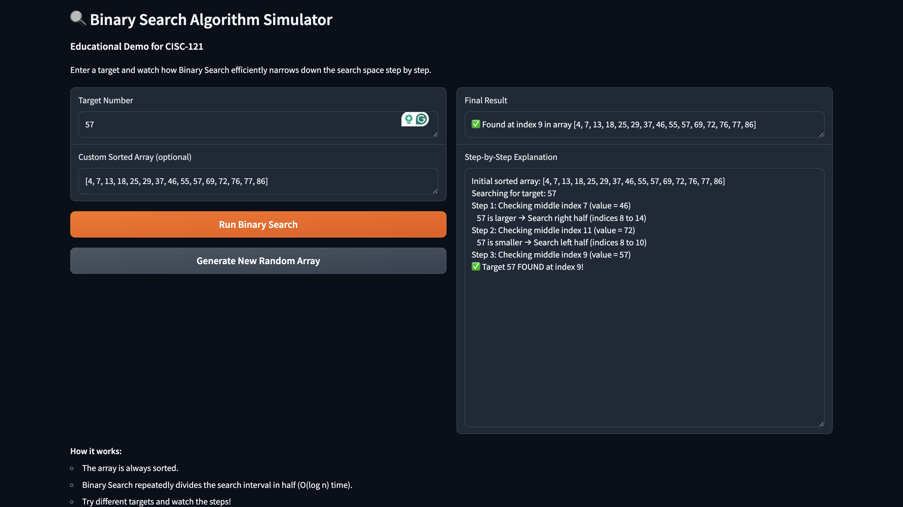
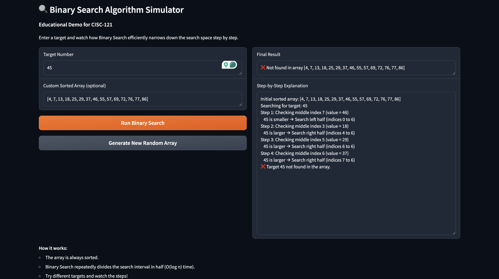

# Binary Search Algorithm Simulator - CISC-121

## Demo

**Live Hugging Face App:**  
[https://huggingface.co/spaces/amxyxv/binary-search-cisc121](https://huggingface.co/spaces/amxyxv/binary-search-cisc121)

**Live Demo:** [Click here to try the app](https://huggingface.co/spaces/amxyxv/binary-search-cisc121)

---

## Problem Breakdown & Computational Thinking

**Why Binary Search?**  
I chose Binary Search because it is a classic and efficient searching algorithm that clearly demonstrates the **divide-and-conquer** strategy. It works only on sorted arrays and is much faster than Linear Search (O(log n) vs O(n)). This makes it an excellent example for teaching algorithm efficiency and binary search logic.

**Computational Thinking:**
- **Decomposition**: Broke the algorithm into smaller steps — initializing left and right pointers, calculating the middle index, comparing values, and narrowing the search range.
- **Pattern Recognition**: The algorithm repeatedly halves the search space based on whether the target is smaller or larger than the middle element.
- **Abstraction**: Hid complex index calculations from the user and showed clear, easy-to-understand step-by-step explanations with emojis and arrows.
- **Algorithm Design**: Input (target number + optional custom array) → Generate/validate sorted array → Perform binary search with detailed logging → Output final result and step-by-step explanation.

---

## Steps to Run Locally

1. Clone or download this repository.
2. Open a terminal in the project folder.
3. Install dependencies: `pip install -r requirements.txt`
4. Run the app: `python3 app.py`
5. Open the local URL shown in the terminal.

---

## Testing & Verification

I tested the following cases:
- Target found in the middle, beginning, and end of the array
- Target not present in the array
- Target smaller or larger than all elements
- Invalid input (letters or empty field) — shows clear error messages
- Using custom sorted array vs random generated array

All test cases worked correctly and displayed informative step-by-step logs.

---

## Author
**Ameya**  
CISC-121 Project  
Thank you to the course guidelines and Gradio documentation for making this project possible.
